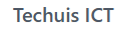

# 🚀 Techuis ICT — IT Support, Computerhulp & Webdesign

<div align="center">

  <p align="center">
    <strong>🇳🇱 Nederlands</strong> •
    <a href="./README.en.md">🇬🇧 English</a>
  </p>

  

  <p align="center">
    <strong>Vakkundige computerhulp aan huis, netwerkoptimalisatie en modern webdesign voor particulieren en ondernemers in Zuid-Holland.</strong>
  </p>

  <p align="center">
    <a href="https://techuis.nl"></a>
    <a href="https://wa.me/31686427359"></a>
    <a href="tel:+31686427359"></a>
  </p>

  <p align="center">
    
    
    
    
    
    
    
    
  </p>

  <p align="center">
    <a href="#-over-techuis-ict">Over Techuis</a> •
    <a href="#-core-features--diensten">Diensten</a> •
    <a href="#-architectuur--tech-stack">Tech Stack</a> •
    <a href="#-seo--lokale-landingspaginas">Lokale SEO</a> •
    <a href="#-security--privacy-audit">Security & Privacy</a> •
    <a href="#-installatie--ontwikkeling">Quickstart</a> •
    <a href="#-projectstructuur">Structuur</a> •
    <a href="#-contact--support">Contact</a>
  </p>

</div>

---

## 📖 Over Techuis ICT

**[Techuis ICT](https://techuis.nl)** is dé betrouwbare IT-partner in Zuid-Holland voor particulieren, senioren en ZZP'ers/MKB. Wij lossen hardnekkige computerproblemen snel, professioneel en tegen eerlijke tarieven op — zowel **aan huis** in de regio als via **hulp op afstand**.

### Kernwaarden
- ⚡ **Snelle respons**: Binnen 2 uur een inhoudelijke reactie op werkdagen.
- 🤝 **Eerlijk advies**: Geen onnodige kosten of ingewikkeld vakjargon; heldere uitleg in begrijpelijke taal.
- 🛡️ **Gecertificeerde expertise**: Ruime ervaring in Microsoft Windows 11, Apple macOS/iOS, thuisnetwerken en webdevelopment.
- 📍 **Regionale focus**: Actief in de regio Rijnmond en Drechtsteden: **Rotterdam, Dordrecht, Spijkenisse en Hoogvliet**.

---

## 🛠️ Core Features & Diensten

Het platform biedt een uitgebreid overzicht van alle IT-diensten met geoptimaliseerde conversiepaden, transparante prijscalculator en directe contactmogelijkheden:

| Dienst | Omschrijving | Pagina |
| :--- | :--- | :--- |
| 💻 **Laptop & PC Reparatie** | Trage werking verhelpen, virussen verwijderen, SSD-upgrades en Windows 11 installaties. | [`computer-laptop.html`](./computer-laptop.html) |
| 📶 **WiFi & Thuisnetwerk** | Slecht bereik op zolder/tuin oplossen, Mesh-netwerken configureren en modem/router installatie. | [`internet-email-thuisnetwerk-wifi.html`](./internet-email-thuisnetwerk-wifi.html) |
| 🖨️ **Printer & Scanner** | Draadloze printerinstallatie, verbindingsfouten oplossen en scannen naar PC/e-mail. | [`printer-scanner.html`](./printer-scanner.html) |
| 📱 **Smartphone & Tablet** | Apple iPhone, iPad en Android installatie, dataoverdracht en e-mail synchronisatie. | [`tablet-ipad.html`](./tablet-ipad.html) / [`telefoon-mobile-apps.html`](./telefoon-mobile-apps.html) |
| 🌐 **Professioneel Webdesign** | Snelle, responsive maatwerkwebsites voor lokale ondernemers en zzp'ers. | [`websitebouwen.html`](./websitebouwen.html) |
| 🎧 **Hulp op Afstand** | Direct meekijken en acute storingen oplossen zonder voorrijkosten via beveiligde software. | [`hulpopstand.html`](./hulpopstand.html) |
| 💶 **Transparante Tarieven** | Duidelijke tariefkaarten zonder verborgen kosten of verrassingen achteraf. | [`tarieven.html`](./tarieven.html) |

---

## 🧠 Kennisbank & 2026 Tech-Gidsen

De website bevat een actuele en SEO-geoptimaliseerde kennisbank met diepgaande handleidingen en praktische stappenplannen:

- 🪟 **Windows 11 in 2026**: Nieuwe instellingen, Copilot AI integratie, privacy-optimalisatie en accu-verbeteringen voor laptops.
- 🍏 **Apple iPhone & iPad (anno 2026)**: Batterijduur verlengen, iCloud-opslagproblemen verhelpen en seniorenbeveiliging met DigiD.
- 🛡️ **Cybersecurity voor thuisgebruikers**: Veilig back-up maken (3-2-1 regel), virusscanners vs. Windows Defender en veilige wachtwoorden.
- 📄 **Gratis downloads**: Uitgebreide PDF-gezondheidscheck voor computers en notebooks.

---

## 🏗️ Architectuur & Tech Stack

Het platform is ontworpen volgens het **zero-runtime overhead** principe. Geen onnodige zware client-side frameworks, maar pure snelheid en maximale uptime:

```
┌─────────────────────────────────────────────────────────────┐
│                       TECHUIS ICT                           │
├─────────────────┬─────────────────────────┬─────────────────┤
│   Presentation  │         Styling         │    Networking   │
│   Semantic HTML5│   Tailwind CSS (JIT)    │   Fetch / AJAX  │
│   W3C Valide    │   assets/css/tailwind   │   FormSubmit.co │
├─────────────────┼─────────────────────────┼─────────────────┤
│   Web Server    │      Optimizations      │   Compliance    │
│   Apache 2.4    │   HTTP/2, Gzip Deflate  │   WCAG 2.1 AA   │
│   .htaccess     │   Browser Caching 1J    │   AVG / GDPR    │
└─────────────────┴─────────────────────────┴─────────────────┘
```

- **Frontend**: Zuivere, semantische **HTML5** (80+ unieke landingspagina's).
- **Styling**: **Tailwind CSS v3.4** gecompileerd met minificatie (`tailwind.min.css`).
- **Scripts**: Lichtgewicht modern **Vanilla JavaScript (ES6+)** voor interacties (postcode-checker, status-badge, interactieve formulieren).
- **Icons**: Ionicons & SVG micro-graphics voor haarscherpe weergave zonder webfont-vertraging.
- **Server**: **Apache 2.4** met een fijnmazige [`.htaccess`](./.htaccess) configuratie voor canonical non-www redirects, HTTPS enforcement en Core Web Vitals caching.

---

## 📍 SEO & Lokale Vindbaarheid

Voor maximale organische vindbaarheid in Google binnen de doelregio beschikt de repository over een modulaire SEO-structuur:

- **Dienst × Regio combinaties**: Specifieke landingspagina's per stad voor hoog-converterende zoekwoorden:
  - Rotterdam: *Laptop traag*, *Computerhulp aan huis*, *WiFi problemen*, *Printer installeren*, *Virus verwijderen*.
  - Dordrecht: Lokale dienstpagina's met unieke metadata en postcodes.
  - Spijkenisse & Hoogvliet: Lokale pagina's gericht op snelle responstijden.
- **Schema.org Structured Data**: JSON-LD microdata voor `LocalBusiness`, `Service`, `FAQPage` en `BreadcrumbList`.
- **Open Graph & Twitter Cards**: Rijke sociale previews voor links gedeeld via WhatsApp, Facebook of LinkedIn.
- **Zoekmachine-infrastructuur**: Volledig bijgewerkte [`sitemap.xml`](./sitemap.xml) en [`robots.txt`](./robots.txt).

---

## 🔒 Security & Privacy Audit

Als onderdeel van professionele engineering is de codebase getoetst aan moderne security best practices:

> [!NOTE]
> **Audit Status**: Geschikt voor publieke GitHub repository. Geen kwetsbare geheimen of privégegevens aanwezig.

| Beveiligingsaspect | Implementatie | Status |
| :--- | :--- | :---: |
| 🔑 **Geen hardcoded secrets** | Nul API-sleutels, database credentials, serverpasswords of tokens in code of git-historie. | ✅ **Veilig** |
| 🛡️ **HTTP Security Headers** | Geconfigureerd in `.htaccess`: `X-Content-Type-Options: nosniff`, `X-Frame-Options: SAMEORIGIN`, `Referrer-Policy: strict-origin-when-cross-origin`, `Permissions-Policy`. | ✅ **Actief** |
| 🚫 **Spambescherming** | Verborgen honeypot veld (`_honey`) en gecontroleerde formuliervalidatie op [`contact.html`](./contact.html). | ✅ **Actief** |
| 🇪🇺 **AVG / GDPR Privacy** | Transparant cookiebeleid (`acceptCookies` / `declineCookies`), privacyverklaring en geen tracking cookies van derden. | ✅ **Compliant** |
| 🧹 **Geen verouderde PII** | Oude KvK-vermeldingen volledig opgeschoond conform de actuele bedrijfssituatie. | ✅ **Schoon** |
| 📁 **Repository Hygiëne** | Uitgebreide [`.gitignore`](./.gitignore) sluit `node_modules/`, `.vscode/` en tijdelijke bestanden structureel uit. | ✅ **Ingericht** |

---

## 🚀 Installatie & Ontwikkeling

### Vereisten
- [Node.js](https://nodejs.org/) (v18 of hoger aanbevolen)
- `npm`

### Stappenplan

1. **Repository klonen**:
   ```bash
   git clone https://github.com/FranklinFranklin/techuis.nl.git
   cd techuis.nl
   ```

2. **Dependencies installeren**:
   ```bash
   npm install
   ```

3. **Tailwind CSS bouwen**:
   ```bash
   # Eenmalige minified productie-build
   npm run build:css

   # Of in watch-modus tijdens ontwikkeling
   npm run dev:css
   ```

4. **Lokale server starten**:
   Open het project via VS Code Live Server, of start direct een lokale HTTP-server:
   ```bash
   # Met npx
   npx serve .

   # Of met Python
   python3 -m http.server 8080
   ```
   Bezoek vervolgens `http://localhost:8080` in de browser.

---

## 📂 Projectstructuur

```text
techuis_ITSupport/
├── .htaccess                 # Apache serverconfiguratie (HTTPS, Caching, Security Headers)
├── .gitignore                # Git uitsluitingen (node_modules, .vscode, OS-meta)
├── 404.html                  # Aangepaste 404 foutpagina
├── index.html                # Hoofdpagina (Hero, diensten, probleem-oplosser, reviews, FAQ)
├── contact.html              # Contactpagina met robuust formulier & WhatsApp noodknop
├── tarieven.html             # Transparante tarievenkaart en uurtarieven
├── overons.html              # Over het team, visie en werkwijze
├── werkwijze.html            # Werkwijze stappenplan (aan huis en op afstand)
├── hulpopstand.html          # Hulp op afstand instructies
├── websitebouwen.html        # Webdesign diensten
├── privacybeleid.html        # AVG / GDPR privacyverklaring
├── algemenvoorwaarden.html   # Algemene voorwaarden
├── sitemap.xml               # XML-sitemap voor zoekmachines
├── robots.txt                # Robots indexeringsrichtlijnen
├── package.json              # Project scripts & devDependencies (Tailwind CSS)
│
├── assets/
│   ├── css/                  # Gecompileerde stylesheets (tailwind.min.css, style.css)
│   ├── src/                  # Bronbestanden voor Tailwind CSS (input.css)
│   ├── images/               # Afbeeldingen, banners en diensticonen
│   └── videos/               # Video previews
│
├── blog/                     # 20+ Actuele tech blogs (Windows 11, Apple iPhone, Security)
├── downloads/                # Digitale gidsen en PDF checklists
└── [regio-pagina's]          # Lokale SEO landingspagina's (Rotterdam, Dordrecht, Spijkenisse, Hoogvliet)
```

---

## 📞 Contact & Support

Heeft u een vraag of wilt u een afspraak inplannen voor computerhulp aan huis?

- 🌐 **Website**: [techuis.nl](https://techuis.nl)
- 📞 **Telefoon**: [06 - 86 42 73 59](tel:+31686427359)
- 💬 **WhatsApp**: [Direct een WhatsApp sturen](https://wa.me/31686427359)
- ✉️ **E-mail**: [info@techuis.nl](mailto:info@techuis.nl)
- ⏱️ **Openingstijden**: Maandag t/m Zaterdag: 08:30 – 21:00 • Zondag: 10:00 – 18:00

---

<div align="center">
  <small>© 2026 Techuis ICT. Alle rechten voorbehouden.</small>
</div>
